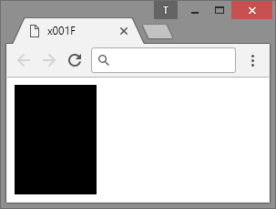

# x001F
CSS GRID FRAMEWORK
  
---
### Usage
```html
<div class="1/3"></div>
```

  
---
### Hops
| IE | Edge | FF   | Chrome | Safari | Opera |
|----|------|------|--------|--------|-------|
| 9+ | 12+  | 3.5+ | 4+     | 3.2+   | 10.1+ |
---
~~IF DOESN'T WORK STEP UP YOUR BROWSER GAME~~  
*(I WROTE THIS OUT OF FRUSTRATION OVER BLOATED CSS POEMS PROMISING VENTURE FUNDING FROM HEAVEN)*
