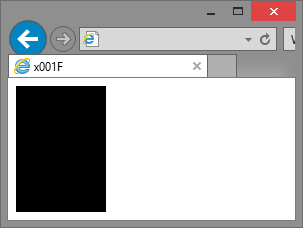

# x001F
CSS GRID FRAMEWORK
  
---
### Usage
```html
<div class="1/3"></div>
```


  
---
### Hops on
| IE | Edge | FF   | Chrome | Safari | Opera |
|----|------|------|--------|--------|-------|
| 9+ | 12+  | 3.5+ | 4+     | 3.2+   | 10.1+ |
  
~~if doesn't work step up your browser game~~  
  
---
*(I wrote this out of frustration over bloated CSS poems promising venture funding from heaven.)*
